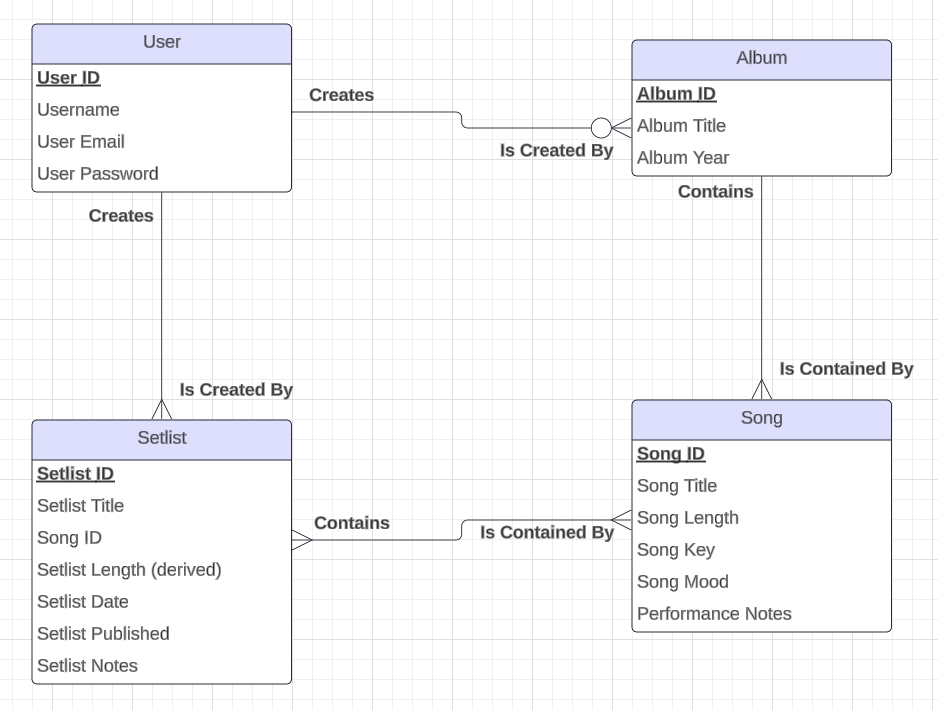

# Setlist Maker

This app will allow musicians to create and organize setlists for their live performances.

## Features

- Upload artist discography information (songs, albums, etc.) manually (or maybe from Spotify/Bandcamp APIs?)
- Add performance attributes to songs, such as key, mood, tuning info, etc.
- Create setlists from uploaded song information
- Add notes to songs and setlists
- Duplicate and modify setlists
- View total setlist time
- Post setlists publicly to artist profile
- Share setlists as a link or printable view

[Link to data model](https://lucid.app/lucidchart/7e1129ae-6b7e-4f46-ada2-3800e2d2f503/edit?viewport_loc=-983%2C43%2C1001%2C705%2C0_0&invitationId=inv_e1087b67-3a13-464b-a180-5bf9b0e9d11f)

